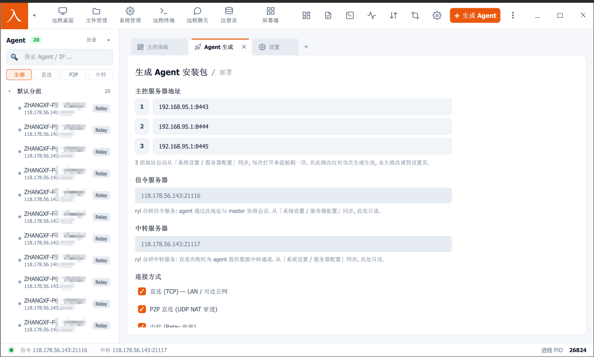
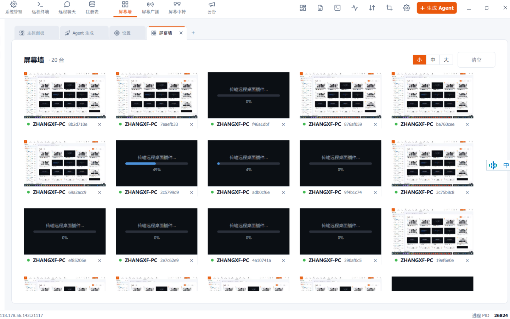

# 银狐源码4.0 - winos4.0

### 银狐源码学习记录

[第 1 课：专栏导论与安全边界](https://mp.weixin.qq.com/s/cFgtXuoDHKtAci5mJ1fqKQ)

[第 2 课：源码整体结构导览](https://mp.weixin.qq.com/s/Cu1PPcPLjsc-yQDndA78rw)

[第 3 课：安装编译与调试环境](https://mp.weixin.qq.com/s/COUbApYHT7FvgrVvECMlTw)

[第 4 课：第三方库下载、编译与依赖管理](https://mp.weixin.qq.com/s/p1uhSDwHgoYJgxT_qWxXJw)

[第 5 课：工程编译顺序与调试方法](https://mp.weixin.qq.com/s/ECDgINUwwDo7eRcrzXu6yA)

[第 6 课：Windows C++/MFC 基础补课](https://mp.weixin.qq.com/s/4GeixpCsrmFE8u3KKA1Jug)

[第 7 课：主控界面布局单独讲解](https://mp.weixin.qq.com/s/WbfIFqjwoso9doUmr5jdlQ)

[第 8 课：主控端架构分析](https://mp.weixin.qq.com/s/-u6hxW43F9pc88muflK90w)

[第 9 课：主控内嵌日志进程与通信机制](https://mp.weixin.qq.com/s/h3E1GV8PZuVwfTtzl2XVOg)

[第 10 课：网络通信模型](https://mp.weixin.qq.com/s/bVh6iAiYvLdYeKsp-2OUlw)

[第 11 课：协议与命令分发机制](https://mp.weixin.qq.com/s/NLj4Mj2SBEI1ma2a17nXdw)

[第 12 课：插件化设计与模块加载总览](https://mp.weixin.qq.com/s/zcxrhnDorGQ1yg2akKOXdw)

[第 13 课：插件化设计与模块加载](https://mp.weixin.qq.com/s/1_poGJRpMNYSfTgdZ2UY6A)

[第 14 课：插件 DLL 内存加载](https://mp.weixin.qq.com/s/Nexxx6aonltu38iPTgtDyw)

[第 15 课：网络库：HPSocket](https://mp.weixin.qq.com/s/0RPv6KxzbUU4pCCOva_RbQ)

[第 16 课：生成 EXE 与 DLL](https://mp.weixin.qq.com/s/rkEUL3uaSb1mJrdK5zQEVw)

[第 17 课：x86/x64 双产物与 DLL 使用](https://mp.weixin.qq.com/s/D-bGZddb71ccOvL7pMr8ZA)

[第 18 课：被控 shellcode 生成与执行流程](https://mp.weixin.qq.com/s/rYZrnUGeMiVbHxtLudOBqA)

[第 19 课：生成被控五个选项下发机制](https://mp.weixin.qq.com/s/Y_V9qwqly2JqkSQkNkAj1A)

[第 20 课：被控线程结构与网络连接结构](https://mp.weixin.qq.com/s/kKH8bUadMGF1tYvNf9G_WA)

[第 21 课：主插件：上线模块](https://mp.weixin.qq.com/s/-n9-dLrzmMszssmnw9r5qA)

[第 22 课：主插件：登录模块](https://mp.weixin.qq.com/s/XnPtueIoeAIouxqzu9mRUA)

[第 23 课：主控复制与转移客户](https://mp.weixin.qq.com/s/-1dQYSyMAyiPTFKvZyr5Iw)

[第 24 课：主插件：系统管理](https://mp.weixin.qq.com/s/vz-8c5lGbD-ChKH20yulww)

[第 25 课：主插件：文件管理](https://mp.weixin.qq.com/s/t4ghpWE3b_dAf05vO1JW0g)

[第 26 课：主插件：查注册表](https://mp.weixin.qq.com/s/a5m3qwb9sMJoDAq6ZjbYsQ)

[第 27 课：主插件：启动管理](https://mp.weixin.qq.com/s/nEzwhEojgHO5Nx-oinUgwQ)

[第 28 课：主插件：远程终端](https://mp.weixin.qq.com/s/3aX2iWkLYNo0fB3eCR-21Q)

[第 29 课：主插件：远程交谈](https://mp.weixin.qq.com/s/3vvJP837fJO-AA2DKDL_xg)

[第 30 课：主插件：键盘记录](https://mp.weixin.qq.com/s/guXyxSNo4uIgULksucKChQ)

[第 31 课：主插件：高速屏幕](https://mp.weixin.qq.com/s/7nwCnGKxfmCyXi6B0fnW_Q)

[第 32 课：主插件：差异屏幕](https://mp.weixin.qq.com/s/8xlxILWHT-m3bOZ3g0-kjg)

[第 33 课：主插件：娱乐屏幕](https://mp.weixin.qq.com/s/kP29lGHQ4UxR05VgH24yYg)

[第 34 课：主插件：后台桌面与后台窗口](https://mp.weixin.qq.com/s/QFfwW5QTau7nI7TNe9J6bA)

[第 35 课：主控屏幕墙与加入监控](https://mp.weixin.qq.com/s/dtsBMw1TZaYEDF4DioNrmg)

[第 36 课：主插件：视频查看](https://mp.weixin.qq.com/s/bhp8XzBwYjzFPQnjMYIKBA)

[第 37 课：主插件：播放监听](https://mp.weixin.qq.com/s/Y2a7jJZqt1aZyF7oR_cwEQ)

[第 38 课：主插件：语音监听](https://mp.weixin.qq.com/s/VhbLaPwWh1KDs2l4ybQmjw)

[第 39 课：主插件：代理映射](https://mp.weixin.qq.com/s/r2iHRaKQdG33Ot5le0XoPQ)

[第 40 课：主插件：压力测试](https://mp.weixin.qq.com/s/uiWd6s-RZ8ETxrQRV830MQ)

[第 41 课：主插件：注入管理](https://mp.weixin.qq.com/s/iLkIfWlZ5LkMKYFqs_2e9w)

[第 42 课：主插件：驱动插件](https://mp.weixin.qq.com/s/5FEcESiEC6U343bHoeCWlg)

[第 43 课：主插件：解密数据](https://mp.weixin.qq.com/s/DNzqKShd0rfXC9UE84EhKA)

[第 44 课：持久化机制综合识别](https://mp.weixin.qq.com/s/z0aY8XhIUwub0wTiGsApOw)

[第 45 课：高危能力综合识别](https://mp.weixin.qq.com/s/B2QkJr4JheymuWiqClUh2Q)

[第 46 课：代理映射、内网扫描与横向风险](https://mp.weixin.qq.com/s/lxBCPFsYF96CG9QpiDCUDQ)

[第 47 课：加密、认证与协议安全缺陷](https://mp.weixin.qq.com/s/DeQSOTHN6WM790hWILjmog)

[第 48 课：C/C++ 安全编码核查](https://mp.weixin.qq.com/s/_kD3mIOjuEIvpCiJc5J4xw)

[第 49 课：检测工程：从源码提取行为特征](https://mp.weixin.qq.com/s/lGTZfuBQx8VDFaYybbJ07Q)

[第 50 课：应急响应与清理思路](https://mp.weixin.qq.com/s/aD0cLY18cGMtAq9d--TjUQ)

[第 51 课：安全重构：把高风险远控改造成合规远程运维工具](https://mp.weixin.qq.com/s/iwln4gY5ZsaQGRdpCh_91w)

[第 52 课：综合案例：写一份企业安全评估报告](https://mp.weixin.qq.com/s/rWYIanTu9Pk4ipiRhkiONA)

### 优化记录

[银狐远控问题排查与修复——Viusal Studio集成Google Address Sanitizer排查内存问题](https://mp.weixin.qq.com/s/_cf2x1dEfc4fKDFXT-Tgog)

[银狐远控代码中差异屏幕bug修复](https://mp.weixin.qq.com/s/OGyXvocJFADDl-46i9wcXA)

[银狐远程屏幕内存优化方法探究](https://mp.weixin.qq.com/s/C_zqweHKrJtIY0oc6kaR2A)

[银狐远程软件bug修复记录 第03篇](https://mp.weixin.qq.com/s/B2jek7bEsLxXbbK0uIL0bA)

[银狐远程软件 UDP 断线无法重连的bug排查和修复](https://mp.weixin.qq.com/s/5yQkYLMZ8XNlxC-wDkPOBw)

[银狐远程软件代理映射功能优化思路分享](https://mp.weixin.qq.com/s/cCCeujkvEf3KYvYjc2Bg3g)

[银狐远程软件去后门方法](https://mp.weixin.qq.com/s/Y0w17qWb3nF8ILpP65F_4g)

[银狐远控一键编译调试与开发教程](https://mp.weixin.qq.com/s/q5meRsSH7UCQlw2uEvkuzw)

[银狐远控免杀与shellcode修复思路分析 01](https://mp.weixin.qq.com/s/o6G1vetqw_tTSj6KFJnKcg)

[详解银狐远控源码中那些C++编码问题](https://mp.weixin.qq.com/s?__biz=Mzk0MjUwNDE2OA==&mid=2247500571&idx=1&sn=9e57cfeb1c51e063f5954fa7caf41676&scene=21#wechat_redirect)

[给银狐远控增加一个小功能01](https://mp.weixin.qq.com/s?__biz=Mzk0MjUwNDE2OA==&mid=2247500609&idx=1&sn=e204c8c65dd0b33cacf3ba8c62c26472&scene=21#wechat_redirect)

[银狐远控的被控端是如何隐藏和保护自己的](https://mp.weixin.qq.com/s?__biz=Mzk0MjUwNDE2OA==&mid=2247500651&idx=1&sn=4597e6792b8516065d045db6ec6b0c65&scene=21#wechat_redirect)

[从银狐复制和转移客户功能的bug说起......](https://mp.weixin.qq.com/s?__biz=Mzk0MjUwNDE2OA==&mid=2247500694&idx=1&sn=b0b40703eb8a579afb76bf8c715087cc&scene=21#wechat_redirect)

[谈几点银狐源码学习感悟](https://mp.weixin.qq.com/s?__biz=Mzk0MjUwNDE2OA==&mid=2247500708&idx=1&sn=e6009d4e4759d723fff3ec1a7c4a4edf&scene=21&token=472283753&lang=zh_CN#wechat_redirect)

[客户端软件的结构设计思考（一）——以银狐主控为例](https://mp.weixin.qq.com/s?__biz=Mzk0MjUwNDE2OA==&mid=2247500736&idx=1&sn=486e89742044a4d46ac838d146a92be9&scene=21#wechat_redirect)

[银狐的插件下发和更新是如何实现的](https://mp.weixin.qq.com/s?__biz=Mzk0MjUwNDE2OA==&mid=2247500831&idx=1&sn=7d2512a9c3675ae7ec021ae4a0496a98&scene=21#wechat_redirect)

[银狐后台桌面实现原理详解（一）](https://mp.weixin.qq.com/s/o2x8iv_s5O7nksj7UG_cuQ)

### 银狐原版与优化版功能对比

| 功能列表                                   | 原版                     | 优化版                            |
| ------------------------------------------ | ------------------------ | --------------------------------- |
| **去后门**                                 | ❌                        | ✅                                 |
| **开发工具**                               | Visual Studio 2010       | Visual Studio 2022                |
| **支持Debug调试**                          | ❌                        | ✅                                 |
| **支持Release发布**                        | ✅                        | ✅                                 |
| **是否支持一键编译**                       | ❌                        | ✅                                 |
| **依赖库代码是否完整**                     | ❌                        | ✅                                 |
| **后台屏幕功能是否可用**                   | ❌                        | ✅                                 |
| **主控运行是否稳定**                       | ❌                        | ✅                                 |
| **被控掉线频率**                           | 高                       | 无                                |
| **UDP重连**                                | 有bug                    | ✅                                 |
| **适配操作系统版本**                       | WinXP、Win7、Win8、Win10 | WinXP、Win7、Win8、Win10、Win11等 |
| **代码风格优化**                           | ❌                        | ✅                                 |
| **系统管理服务列表显示是否需要管理员权限** | 需要                     | 不需要                            |
| **复制转移被控功能**                       | 无法正常使用             | 正常使用                          |
| **生成高权限被控端**                       | ❌                        | ✅                                 |
| **批量生成被控端**                         | ❌                        | ✅                                 |

### 源码获取

1. **文章介绍的内容仅做技术上的交流，请勿使用介绍的技术做其他用途，违者与作者无关。**
2. **源码仅用于个人学习研究、网络安全攻防演练，黑灰产勿扰。**

加微信`easy_coder`，非诚勿扰。

### 入云龙大型商业远控

带你从零用AI开发大型商业远程控制套件训练营，报名[链接](https://mp.weixin.qq.com/s/4_7YD-fJEH0tar6W99TlqQ)，备注“训练营”，非诚勿扰。
