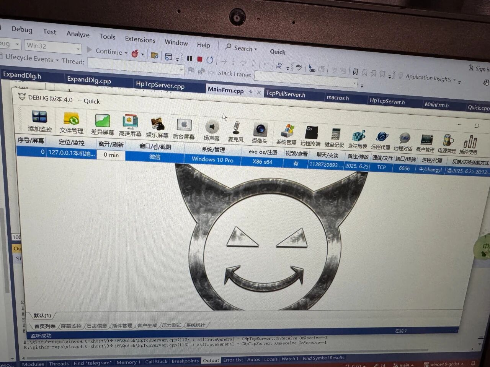

# 银狐源码4.0 - winos4.0

### 优化记录

[银狐远控问题排查与修复——Viusal Studio集成Google Address Sanitizer排查内存问题](https://mp.weixin.qq.com/s/_cf2x1dEfc4fKDFXT-Tgog)

[银狐远控代码中差异屏幕bug修复](https://mp.weixin.qq.com/s/OGyXvocJFADDl-46i9wcXA)

[银狐远程屏幕内存优化方法探究](https://mp.weixin.qq.com/s/C_zqweHKrJtIY0oc6kaR2A)

[银狐远程软件bug修复记录 第03篇](https://mp.weixin.qq.com/s/B2jek7bEsLxXbbK0uIL0bA)

[银狐远程软件 UDP 断线无法重连的bug排查和修复](https://mp.weixin.qq.com/s/5yQkYLMZ8XNlxC-wDkPOBw)

[银狐远程软件代理映射功能优化思路分享](https://mp.weixin.qq.com/s/cCCeujkvEf3KYvYjc2Bg3g)

[银狐远程软件去后门方法](https://mp.weixin.qq.com/s/Y0w17qWb3nF8ILpP65F_4g)

[银狐远控一键编译调试与开发教程](https://mp.weixin.qq.com/s/q5meRsSH7UCQlw2uEvkuzw)

[银狐远控免杀与shellcode修复思路分析 01](https://mp.weixin.qq.com/s/o6G1vetqw_tTSj6KFJnKcg)

[详解银狐远控源码中那些C++编码问题](https://mp.weixin.qq.com/s?__biz=Mzk0MjUwNDE2OA==&mid=2247500571&idx=1&sn=9e57cfeb1c51e063f5954fa7caf41676&scene=21#wechat_redirect)

[给银狐远控增加一个小功能01](https://mp.weixin.qq.com/s?__biz=Mzk0MjUwNDE2OA==&mid=2247500609&idx=1&sn=e204c8c65dd0b33cacf3ba8c62c26472&scene=21#wechat_redirect)

[银狐远控的被控端是如何隐藏和保护自己的](https://mp.weixin.qq.com/s?__biz=Mzk0MjUwNDE2OA==&mid=2247500651&idx=1&sn=4597e6792b8516065d045db6ec6b0c65&scene=21#wechat_redirect)

[从银狐复制和转移客户功能的bug说起......](https://mp.weixin.qq.com/s?__biz=Mzk0MjUwNDE2OA==&mid=2247500694&idx=1&sn=b0b40703eb8a579afb76bf8c715087cc&scene=21#wechat_redirect)

[谈几点银狐源码学习感悟](https://mp.weixin.qq.com/s?__biz=Mzk0MjUwNDE2OA==&mid=2247500708&idx=1&sn=e6009d4e4759d723fff3ec1a7c4a4edf&scene=21&token=472283753&lang=zh_CN#wechat_redirect)

[客户端软件的结构设计思考（一）——以银狐主控为例](https://mp.weixin.qq.com/s?__biz=Mzk0MjUwNDE2OA==&mid=2247500736&idx=1&sn=486e89742044a4d46ac838d146a92be9&scene=21#wechat_redirect)

[银狐的插件下发和更新是如何实现的](https://mp.weixin.qq.com/s?__biz=Mzk0MjUwNDE2OA==&mid=2247500831&idx=1&sn=7d2512a9c3675ae7ec021ae4a0496a98&scene=21#wechat_redirect)

[银狐后台桌面实现原理详解（一）](https://mp.weixin.qq.com/s/o2x8iv_s5O7nksj7UG_cuQ)

### 银狐原版与优化版功能对比

| 功能列表                                   | 原版                     | 优化版                            |
| ------------------------------------------ | ------------------------ | --------------------------------- |
| **去后门**                                 | ❌                        | ✅                                 |
| **开发工具**                               | Visual Studio 2010       | Visual Studio 2022                |
| **支持Debug调试**                          | ❌                        | ✅                                 |
| **支持Release发布**                        | ✅                        | ✅                                 |
| **是否支持一键编译**                       | ❌                        | ✅                                 |
| **依赖库代码是否完整**                     | ❌                        | ✅                                 |
| **后台屏幕功能是否可用**                   | ❌                        | ✅                                 |
| **主控运行是否稳定**                       | ❌                        | ✅                                 |
| **被控掉线频率**                           | 高                       | 无                                |
| **UDP重连**                                | 有bug                    | ✅                                 |
| **适配操作系统版本**                       | WinXP、Win7、Win8、Win10 | WinXP、Win7、Win8、Win10、Win11等 |
| **代码风格优化**                           | ❌                        | ✅                                 |
| **系统管理服务列表显示是否需要管理员权限** | 需要                     | 不需要                            |
| **复制转移被控功能**                       | 无法正常使用             | 正常使用                          |

### 源码获取

1. **文章介绍的内容仅做技术上的交流，请勿使用介绍的技术做其他用途，违者与作者无关。**
2. **源码仅用于个人学习研究、网络安全攻防演练，黑灰产勿扰。**

加微信`easy_coder`，非诚勿扰。